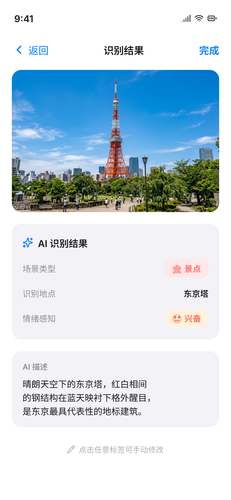
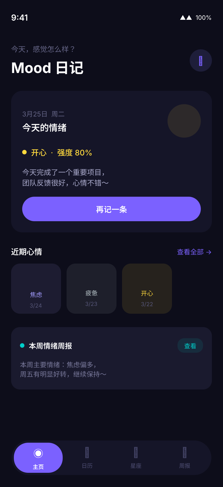
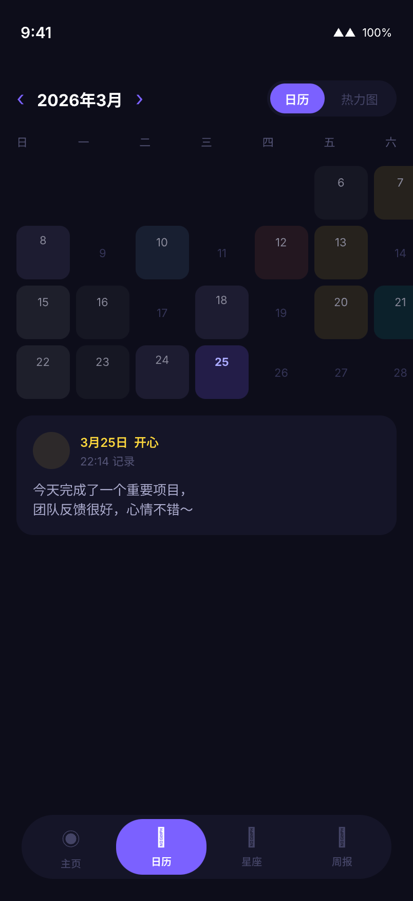
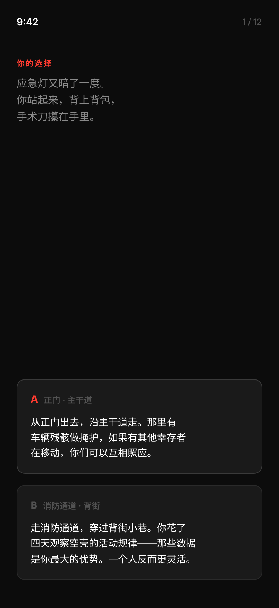

# Claude Build Pipeline

> **一句话说完 App 想法 → 自动完成需求、调研、设计、编码、部署、验收。**

一套基于 Claude Code 的 **9 阶段产品构建流水线**。不是 Copilot 式的"帮你补代码"，而是一个**完整的产品经理 + 设计师 + 工程团队**在 CLI 里协作。

已用它从零构建了 **20+ 个完整应用**——从微信小程序到 macOS 桌面端，从 AI 旅行日记到互动故事游戏。

---

## 展示：真实产出

以下全部由 `/build` 一条命令从零生成（需求 → 设计 → 代码 → 验收）：

### AI 旅行日记
拍照自动识别场景，生成旅行游记。

<p align="center">


</p>

### Mood 日记 — AI 情绪追踪
记录情绪，AI 生成周报洞察。日历热力图可视化心情变化。

<p align="center">


</p>

### MBTI 互动故事游戏
末日题材选择型故事，12 个决策点揭示性格类型。

<p align="center">


</p>

---

## 为什么它不一样

### 对比现有方案

| | 普通 AI 编程助手 | Cursor/Copilot | **Build Pipeline** |
|---|---|---|---|
| 需求分析 | ❌ 你自己写 | ❌ 你自己写 | ✅ 自动追问、对齐、输出规格文档 |
| 竞品调研 | ❌ | ❌ | ✅ 多平台爬取 + 用户心声分析 |
| 产品方案 | ❌ | ❌ | ✅ 完整 PRD + 独立审查 agent 校验 |
| UI 设计 | ❌ | ❌ | ✅ 多方向探索 → 美学审查 → 设计稿 |
| 代码实施 | ✅ 单文件 | ✅ 单文件 | ✅ 多 agent 并行 + Phase 编译验证 |
| 质量验收 | ❌ | ❌ | ✅ 对照需求逐项检查，覆盖率量化 |
| 迭代闭环 | ❌ | ❌ | ✅ 验收发现问题 → 自动回环到对应阶段 |

### 核心卖点

**1. 一条命令启动全流程**
```
/build 我要做一个宠物翻译器小程序
```
不需要写 PRD、不需要画原型、不需要拆任务——系统引导你完成一切。

**2. 15 个专家 Agent 协作**
不是一个 AI 做所有事。调研有专门的 researcher、设计有 5 个设计专家（研究员、设计师、UX 审查、美学审查、规格提取）、代码有独立的 reviewer。**专业分工，互相校验**。

**3. 复杂度自适应**
同一套流程，小功能 30 分钟跑完（跳过调研/设计），大产品数小时深度执行（全阶段 + 多轮审查）。你只需选择 small/medium/large。

**4. 状态持久化，随时续接**
每个阶段产出写入文件，manifest 追踪进度。关掉终端明天接着做，从上次停的地方继续——不丢上下文。

**5. 迭代闭环**
验收阶段对照需求逐项检查（覆盖率 87%？哪 13% 没做到？），发现问题自动推荐回到对应阶段修复。**不是"做完就完"，而是"做对才完"。**

**6. 设计稿是真的**
不是 ASCII mockup，不是截图拼图——通过 Pencil MCP 生成可交互的高保真设计稿（.pen），然后代码严格按设计规格的像素值实现。

---

## 9 阶段流水线

```
/build 我要做 XX
     │
     ▼
┌─────────┐    ┌──────────┐    ┌─────────┐    ┌────────┐
│ Specify │───▶│ Research │───▶│  Value  │───▶│  Plan  │
│ 需求对齐 │    │ 竞品调研  │    │ 价值判断 │    │ 产品方案 │
└─────────┘    └──────────┘    └─────────┘    └────────┘
                                                    │
     ┌──────────────────────────────────────────────┘
     ▼
┌─────────┐    ┌───────────┐    ┌───────────┐
│ Design  │───▶│ Code-Plan │───▶│ Implement │
│ 交互设计 │    │  任务拆解  │    │  多Agent  │
└─────────┘    └───────────┘    └───────────┘
                                       │
     ┌─────────────────────────────────┘
     ▼
┌─────────┐    ┌─────────┐
│ Deploy  │───▶│ Review  │───▶ 验收通过 🎉
│  部署   │    │  验收   │    或回环修复 🔄
└─────────┘    └─────────┘
```

每个阶段可跳过 | 支持回环迭代 | 复杂度自适应

---

## 快速开始

```bash
git clone <this-repo> claude-build-pipeline
cd claude-build-pipeline
bash install.sh
```

然后在 Claude Code 中：
```
/build 我要做一个 XX 功能
```

### 安装选项

```bash
bash install.sh              # 完整安装
bash install.sh --no-design  # 跳过设计阶段（无 Pencil MCP 时）
bash install.sh --no-feishu  # 跳过飞书相关组件
bash install.sh --upgrade    # 升级（覆盖已有文件）
```

### 卸载

```bash
bash uninstall.sh
```

---

## 前置依赖

| 依赖 | 必需？ | 用途 |
|------|--------|------|
| [Claude Code](https://claude.ai/code) | ✅ 必需 | 运行环境 |
| Python 3.10+ | ✅ 必需 | 前置检查脚本 |
| [Pencil MCP](https://pencil.li) | 设计阶段必需 | 生成 UI 设计稿 |
| Playwright MCP | 可选 | 浏览器自动化验证 |

详见 [docs/PREREQUISITES.md](docs/PREREQUISITES.md)

---

## 架构亮点

| 设计 | 为什么这样做 |
|------|-------------|
| **Manifest 驱动** | `_manifest.json` 是状态唯一源，关掉终端不丢进度 |
| **文件契约** | 阶段间通过产出文件传递数据，不依赖对话上下文 |
| **HARD-GATE** | 关键节点必须人工确认，防止 AI 失控 |
| **复杂度自适应** | small/medium/large 三档影响执行深度 |
| **多 Agent 分工** | 15 个专家角色各司其职，互相校验 |
| **经验记忆** | 踩坑经验持久化，下次不重蹈覆辙 |

详见 [docs/ARCHITECTURE.md](docs/ARCHITECTURE.md)

---

## 已验证的产出

| 项目 | 类型 | 完成阶段 |
|------|------|---------|
| 宠物行为分析器 | 微信小程序 | 全流程（8/9 阶段） |
| Mood 日记 | iOS App | specify → code-plan |
| AgentOS Desktop | macOS App | specify → implement |
| AI 短剧非洲本地化 | 市场调研 | specify → plan |
| MBTI 互动故事 | 微信小程序 | 含设计导出 |
| AI 旅行日记 | iOS App | 含 UI 截图 |
| 垃圾分类 Android | Android App | specify → code-plan |
| 花卉养护助手 | 跨平台 | specify → plan |
| ... 等 20+ 项目 | | |

---

## 定制

详见 [docs/CUSTOMIZATION.md](docs/CUSTOMIZATION.md)

---

## License

MIT
