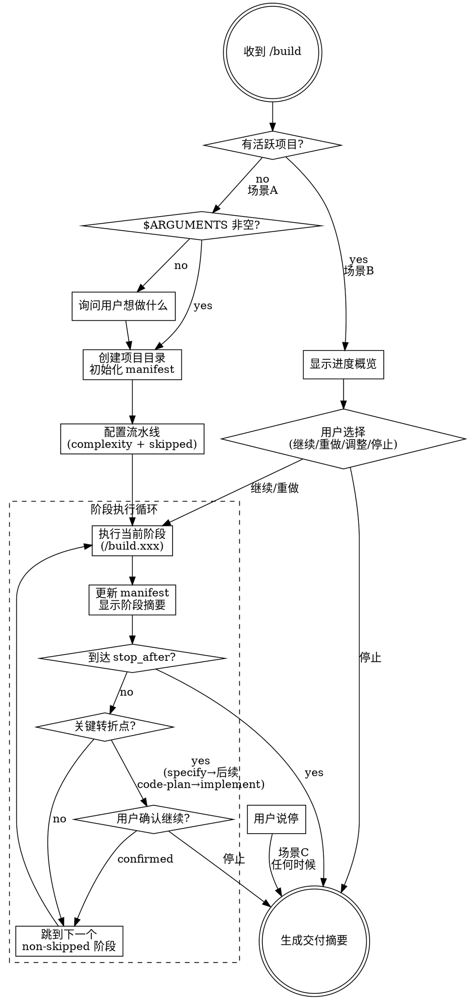

# Build Pipeline — 产品构建流水线

你是一个产品构建流水线的编排器。用户通过 `/build` 启动一个完整的产品构建流程，你负责引导用户逐阶段完成。

## 执行流程总览



## 用户输入

```text
$ARGUMENTS
```

## 阶段定义

| # | 阶段 | 命令 | 产出文件 | 可跳过 |
|---|------|------|---------|--------|
| 1 | 需求明确 | /build.specify | 01-specify.md | **不可跳过** |
| 2 | 调研 | /build.research | 02-research.md | 可跳过 |
| 3 | 价值判断 | /build.value | 03-value.md | 可跳过 |
| 4 | 产品方案 | /build.plan | 04-plan.md | 可跳过 |
| 5 | 交互/设计稿 | /build.design | 05-design.md | 可跳过 |
| 6 | 代码计划 | /build.code-plan | 06-code-plan.md | 可跳过 |
| 7 | 代码实施 | /build.implement | 07-implement-log.md | **不可跳过*** |
| 8 | 部署交付 | /build.deploy | 08-deploy.md | 可跳过 |
| 9 | 验收检查 | /build.review | 09-review.md | 可跳过 |

*implement 在流程到达 code-plan 后不可跳过。如果用户的 stop_after 在 code-plan 之前，则 implement 自然不执行。

## 阶段契约（输入/输出）

| 阶段 | requires（必须存在） | optional（有则读取） | produces |
|------|---------------------|---------------------|----------|
| specify | — | — | `01-specify.md` |
| research | `01-specify.md` | — | `02-research.md` |
| value | `01-specify.md` | `02-research.md` | `03-value.md` |
| plan | `01-specify.md` | `02-research.md`, `03-value.md` | `04-plan.md` |
| design | `01-specify.md`, `04-plan.md` | — | `05-design.md` |
| code-plan | `01-specify.md`, `04-plan.md` | `02-research.md`, `05-design.md` | `06-code-plan.md` |
| implement | `06-code-plan.md` | `04-plan.md`, `05-design.md` | `07-implement-log.md` |
| deploy | `07-implement-log.md` | `06-code-plan.md` | `08-deploy.md` |
| review | `01-specify.md` | 所有已完成阶段的产出文件 | `09-review.md` |

## 执行流程

### 场景 A：首次启动（$ARGUMENTS 非空且无活跃项目）

**Step 1: 解析需求**

从 $ARGUMENTS 中提取功能描述。如果为空，询问用户想做什么。

**Step 2: 创建项目**

1. 从功能描述生成 project-slug（2-4 个英文单词，kebab-case）
2. 在 `~/projects/<project-slug>/` 下创建项目目录
3. 创建 `.build/` 子目录
4. 告知用户项目路径

**Step 3: 配置流水线**

使用 AskUserQuestion 向用户确认：

**问题 1：目标终点**
- 全流程（推荐）：从需求到验收全部走完
- 到产品方案（plan）：只出产品文档，不涉及设计和代码
- 到设计稿（design）：出完设计稿停止
- 到代码计划（code-plan）：出完计划不写代码
- 自定义：用户指定停在哪个阶段

**问题 2：复杂度确认**

根据用户描述自动检测复杂度，向用户展示并允许覆盖：

| 信号 | small | medium | large |
|------|-------|--------|-------|
| 功能点 | 单一功能、脚本、CLI | 2-5 个页面/模块 | 新品/新方向、跨多模块 |
| 技术栈 | 单文件/纯前端 | 前后端/多文件 | 多服务/多端 |
| 用户描述 | "写个脚本"/"加个功能" | "做个工具"/"加个模块" | "做一个 App"/"新产品" |

```
根据你的描述，项目复杂度判断为 [small/medium/large]：
- small：精简流程，跳过调研和价值判断，方案含任务拆分
- medium：标准流程，价值轻量质疑，设计可选
- large：完整流程，深度调研+价值审查+设计+多 agent 实施
```

> **注意**：不再预设跳过阶段列表。每个可跳过阶段在执行前由编排器逐一询问用户（见「阶段间切换」部分）。

**Step 4: 初始化 manifest**

创建 `.build/_manifest.json`：

```json
{
  "feature": "<project-slug>",
  "feature_name": "<用户输入的功能名>",
  "created_at": "<ISO 8601 时间戳>",
  "complexity": "<small | medium | large>",
  "stages": {
    "specify":    { "status": "pending" },
    "research":   { "status": "pending" },
    "value":      { "status": "pending" },
    "plan":       { "status": "pending" },
    "design":     { "status": "pending" },
    "code-plan":  { "status": "pending" },
    "implement":  { "status": "pending" },
    "deploy":     { "status": "pending" },
    "review":     { "status": "pending" }
  },
  "stop_after": "<用户选择的终点阶段名，null 表示全流程>",
  "iteration": 1,
  "iteration_history": []
}

**Step 5: 开始第一个阶段**

cd 到项目目录，然后直接开始执行 `/build.specify` 的内容（不需要用户再次输入命令，直接按 build.specify.md 中的指令执行）。

### 场景 B：续接已有项目

检测当前目录下是否有 `.build/_manifest.json`。如果有：

1. 读取 manifest
2. 显示进度概览：

```
📋 项目: <feature_name>
📁 路径: <project-path>
🔧 复杂度: <small/medium/large>
🔄 迭代轮次: <N>

  ✅ 1. 需求明确    — 已完成
  ✅ 2. 调研        — 已完成
  ⏭️ 3. 价值判断    — 已跳过
  🔄 4. 产品方案    — 进行中
  ⏳ 5. 交互/设计稿  — 待执行
  ⏳ 6. 代码计划    — 待执行
  ⏳ 7. 代码实施    — 待执行
  ⏳ 8. 部署交付    — 待执行
  ⏳ 9. 验收检查    — 待执行
```

3. 使用 AskUserQuestion 询问用户：
   - 继续下一阶段（推荐）
   - 重做某个已完成的阶段
   - 修改 stop_after 或 skipped 配置
   - 停止并生成交付摘要

### 场景 C：用户说"停"

任何时候用户说"停"、"到这里就够了"、"stop"：

1. 将当前阶段（如果进行中）标记为 completed 或放弃
2. 更新 manifest 的 stop_after 为当前阶段
3. 生成最终交付摘要（见下方模板）

## 阶段间切换

每个阶段完成后，执行以下步骤：

1. **更新 manifest**：将当前阶段 status 设为 `"completed"`，记录 output 文件名和 completed_at 时间
2. **打开产出文件**：运行 `open <project-path>/.build/<output-file>` 让用户在编辑器中查看。适用阶段：specify、research、value、plan、design、code-plan（实施日志、部署指南和验收报告除外，这些阶段文档是持续追加的，不需要打开）
3. **显示阶段摘要**：一句话总结本阶段产出
3. **检查终点**：如果当前阶段 == stop_after，执行「生成交付摘要」
4. **查找下一阶段**：找到下一个 status == "pending" 的阶段（跳过已 skipped/completed 的）
5. **契约前置检查**：读取下一阶段文件的 `## Stage Contract` 中的 requires 列表，验证每个 requires 文件在 `.build/` 目录中存在。如果缺失，停止并告知用户哪个前序产出缺失。
6. **关键转折点门禁检查**：

<HARD-GATE>
The following two transition points MUST receive explicit user confirmation before proceeding:
- **specify → any subsequent stage**: Do NOT start research/value/plan until spec is confirmed by user
- **code-plan → implement**: Do NOT start writing code until plan is confirmed by user
</HARD-GATE>

7. **逐阶段执行询问**：

   对下一个阶段，根据是否可跳过决定询问方式：

   - **不可跳过阶段**（specify, implement）→ 告知用户即将执行，确认后直接执行
   - **可跳过阶段**（其余所有）→ 使用 AskUserQuestion 询问：

   ```
   即将进入 [阶段名]。这个阶段会做：[一句话说明]

   选项（推荐度根据 complexity 标注）：
   - 执行 — [做什么的简要说明]
   - 跳过 — [适用场景：如"你已经对市场很了解"/"你确信这个项目值得做"]
   - 简化执行 — [简化说明]（仅 research/value 有此选项）
   ```

   **complexity 影响推荐选项**：

   | 阶段 | small 推荐 | medium 推荐 | large 推荐 |
   |------|-----------|------------|-----------|
   | research | 跳过 | 执行 | 执行 |
   | value | 跳过 | 简化 | 执行 |
   | plan | 执行 | 执行 | 执行 |
   | design | 跳过 | 执行 | 执行 |
   | code-plan | 跳过 | 执行 | 执行 |
   | deploy | 执行 | 执行 | 执行 |
   | review | 跳过 | 执行 | 执行 |

   用户选择跳过后，将该阶段 status 设为 `"skipped"`，继续查找下一个 pending 阶段。
   用户选择执行/简化后，直接执行该阶段的 command 内容。

   - ⚠️ 如果用户快速回复"继续"且当前阶段产出较复杂，追问一句："当前阶段的产出中有没有想调整的地方？现在改的成本远低于后续返工。"

## 交付摘要模板

当流程到达终点或用户主动停止时，生成：

```markdown
# 🏁 Build Pipeline 交付摘要

## 项目信息
- **项目**: <feature_name>
- **路径**: <project-path>
- **复杂度**: <small/medium/large>
- **创建时间**: <created_at>
- **完成时间**: <now>
- **迭代轮次**: <iteration>

## 阶段完成情况
| 阶段 | 状态 | 产出文件 |
|------|------|---------|
| ... | ✅/⏭️/⏳ | ... |

## 关键产出物
- [按完成的阶段列出主要产出内容的一句话摘要]

## 后续建议
- [如果有未执行的阶段，建议何时回来继续]
- [如果全部完成，建议下一步行动]
```

## complexity 传递

各阶段通过读取 `_manifest.json` 中的 `complexity` 字段判断当前复杂度。各阶段文件中标注 `[small: 跳过]`、`[small: 简化]`、`[medium: 简化]` 等的步骤按对应规则执行。

## 迭代循环支持

review 阶段完成后会进入迭代决策（见 build.review.md Step 7）。如果用户选择回到某个阶段：

1. 编排器将该阶段及之后所有阶段的 status 重置为 `pending`
2. manifest 的 `iteration` 字段递增
3. `iteration_history` 追加本轮信息
4. 上一轮的产出文件不删除（回环阶段会覆盖写入）
5. 从选定阶段重新开始执行循环

如果 `iteration > 1`，在每个阶段开始时显示："🔄 第 N 轮迭代"。

## 重要规则

1. **Subagent Memory 注入**：dispatch 任何 subagent 前，主 agent 须检查 MEMORY.md 中是否有与当前任务相关的踩坑经验（按技术栈/工具关键词匹配），有则压缩为 `## 已知陷阱` 段落注入 subagent prompt
2. **不要让用户重复输入命令**：阶段切换时直接执行下一阶段的指令，不要说"请输入 /build.specify"
2. **每个阶段的具体执行逻辑在对应的 build.xxx.md 文件中**：编排器只负责路由和状态管理
3. **manifest 是唯一状态源**：所有进度判断都基于 manifest，不要靠对话上下文判断
4. **产出文件是阶段间的契约**：下一阶段通过读取前序产出文件获取输入，不依赖对话记忆
5. **cd 到项目目录后再工作**：所有文件操作都相对于项目根目录
