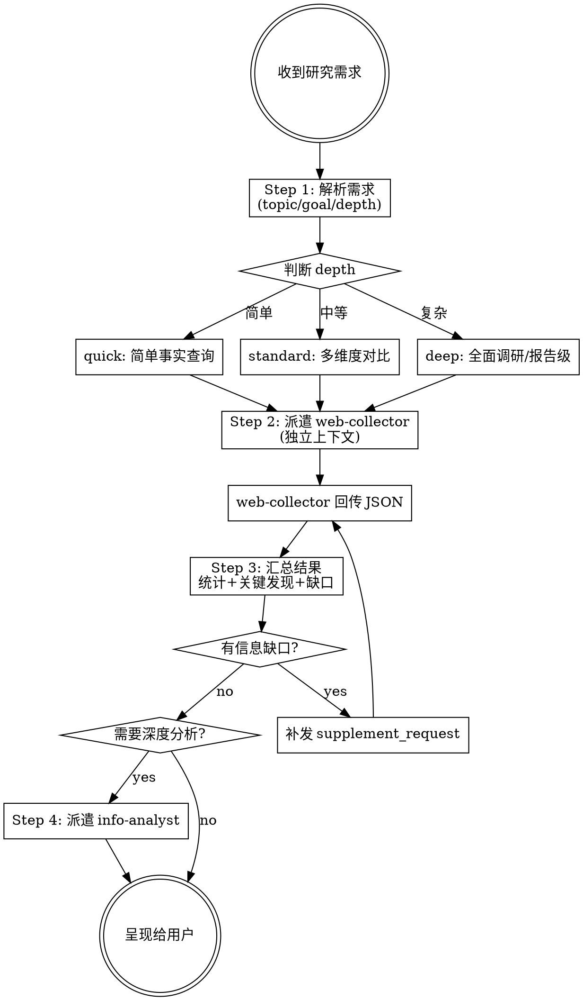

# Web Research Skill

将用户的研究需求转化为 web-collector subagent 的结构化输入，派遣执行，汇总结果。

## 执行流程总览



## Step 1: 解析需求

从用户输入中提取：

| 参数 | 来源 | 示例 |
|------|------|------|
| `topic` | 用户说的主题 | "国内 AI 编程工具" |
| `research_goal` | 用户想知道什么 | "用户口碑和工具对比" |
| `keywords_hint` | 从主题推导的关键词 | ["Claude Code", "Cursor", "通义灵码"] |
| `depth` | 根据问题复杂度判断 | quick/standard/deep |
| `language` | 根据主题语境 | "中文为主" |

**depth 判断规则**：
- 简单事实查询 → `quick`（"XX 产品怎么样"）
- 多维度对比 → `standard`（"对比几个工具的优缺点"）
- 全面调研/报告级 → `deep`（"写一份行业分析报告"）

## Step 2: 派遣 web-collector

用 Agent tool 派遣 web-collector subagent，提供完整的输入参数。

**prompt 模板**：

```
你是 web-collector，请执行以下搜索任务：

topic: {topic}
research_goal: {research_goal}
keywords_hint: {keywords_hint}
depth: {depth}
language: {language}
extra_context: {extra_context}

请按照你的搜索规划流程执行：
1. 分解子主题
2. 选择平台组合
3. 逐条执行 search.py
4. 缺口检查和补搜
5. 回传 JSON 结果

使用 search.py 统一搜索引擎：
~/scrapling-env/bin/python3 ~/.claude/scripts/search.py --platform <id> --query "关键词" --limit 10
~/scrapling-env/bin/python3 ~/.claude/scripts/search.py --site <domain> --query "关键词" --limit 10
~/scrapling-env/bin/python3 ~/.claude/scripts/search.py --comments "URL" --limit 20
```

**subagent 配置**：
- `subagent_type`: `web-collector`
- `mode`: `bypassPermissions`（search.py 是只读脚本，无破坏性）

## Step 3: 汇总结果

收到 web-collector 回传的 JSON 后：

1. **统计概览**：X 个平台、Y 条结果、覆盖了哪些来源
2. **关键发现**：按主题维度归类，提炼高互动/高权威的内容
3. **信息缺口**：如果有 collection_gaps，告知用户并建议补救方式
4. **呈现给用户**：简洁摘要 + 关键原始材料引用

## Step 4: 可选深度分析

如果用户需要更深入的分析（交叉验证、情感分析、结论提炼），派遣 info-analyst subagent。

## 关键规则

- **不要在主对话中自己搜索**——所有搜索都通过 web-collector 在独立上下文中完成
- **不要猜测搜索结果**——等 web-collector 回传后再呈现
- **如果结果不够**——可以补发 supplement_request 给 web-collector 再搜一轮
- **保持 web-collector 的独立性**——它回传 JSON 就行，不需要给它额外上下文
